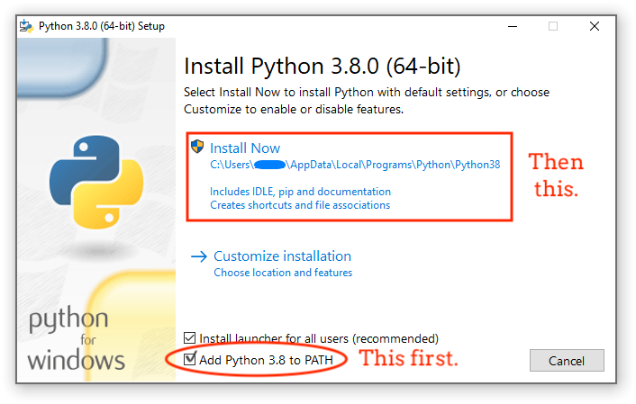

# 🗣️ Voice to Text (PhoWhisper - Tiếng Việt)

Ứng dụng web đơn giản dùng để chuyển giọng nói tiếng Việt từ file `.wav` sang văn bản, sử dụng mô hình `vinai/PhoWhisper-small`.

### Yêu cầu
- Tải Python:
    - Kiểm tra xem máy đã cài python chưa
    ```bash
    python --version
    ```
    - Nếu hiện thông tin version thì bỏ qua bước này và sang phần cài đặt luôn
    => Tải Python: https://www.python.org/ftp/python/3.11.9/python-3.11.9-amd64.exe

    Nhớ nhấn chọn add Python to Path khi mở file cài đặt lên
    

## 🚀 Tính năng
- Tải lên file âm thanh `.wav`
- Chuyển giọng nói sang văn bản tiếng Việt
- Giao diện thân thiện với Streamlit

## 🛠️ Cài đặt

### 1. Clone repo và tạo môi trường ảo (tùy chọn):
```bash
git clone https://github.com/0121ienT/Whisper-ASR.git
```
### 2. Vào trong folder dự án
```bash 
cd Whisper-ASR
```
### 3. Tải các thư viện cần thiết
```bash
pip install -r requirements.txt
```

### 4. Chạy ứng dụng
```bash
streamlit run try.py
```
Lưu ý: Vì lần đầu chạy mô hình sẽ có khả năng là hơi lâu nhưng việc load model chỉ lâu lần đầu tiên chạy, lần sau chạy cái được luôn

Dữ liệu cho bà test nhá: https://drive.google.com/drive/folders/1gBjAMABXvNOjJ_UTvx9z1PeWdRAa2Jfo?usp=sharing 
Bóc sceret từng file audio thôi 